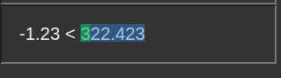

# demo video  
## https://youtu.be/wM4O9Ij0DpM

[](http://www.youtube.com/watch?v=wM4O9Ij0DpM "input_type_textnumber")

<iframe width="560" height="315" src="https://www.youtube.com/embed/wM4O9Ij0DpM" title="YouTube video player" frameborder="0" allow="accelerometer; autoplay; clipboard-write; encrypted-media; gyroscope; picture-in-picture" allowfullscreen></iframe>

# when the cursor is on the number, use the arrow keys to increase/decrease it
this is a small library that checks if the current cursor in an input field is next or right in a number, if that is the case, the number gets highlighted, when a number is highlighted it can be changed with arrow up and arrow down, if a modifier key is pressed (shift/control/alt) the step of the number change changes aswell

## why 
i use this library for text input fields with text that gets evaluated as a function

## controls 
when a certain modifier key is pressed the step changes 

|key combo|step|
|---|---:|
|'ctrl' + 'arrow'| +- 100|
|'shift' + 'arrow'| +- 10|
|'only arrow'| +- 1|
|'alt' + 'arrow'| +- 0.1|

## demo 

```
cd ./node_modules/input_type_textnumber
node app.js
```
then visit localhost:3000/demo.html

## usage 

js
```js
//... 
import o_input_type_textnumber from "./input_type_textnumber.js"
// steps can be customized 
o_input_type_textnumber.n_step_ctrl = 112
o_input_type_textnumber.n_step_shift = 11.235
o_input_type_textnumber.n_step = 1.12358
o_input_type_textnumber.n_step_alt = 0.11235813
//... 
```
html 
```html
 <input type="text" value="-1.23 < 321.123" data_input_type_textnumber="true">
```

css 
```css
.data_input_type_textnumber_highlight_number {
    background: rgba(46, 142, 238, 0.4) !important;
    /* disply none to completly hide it */
    /* display: none !important; add  */
}

.data_input_type_textnumber_highlight_char {
    background: rgba(62, 211, 25, 0.4) !important;
    /* disply none to completly hide it */
    /* display: none !important; add  */
}
```

## preview 
